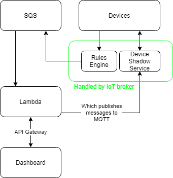

## Challenge Instructions

- Setup an AWS MQTT Broker
  - Pem file for creds to logon and publish/subscribe messages
- Publish and subscirbe to a random topic using python
  - Create a new topic and then test it out using AWS console.
  - Publish and subscribe using Python.
- Use Amazon SQS to parse messages that are being printed on MQTT and write them to a Dashboard.
  - Link SQS to MQTT broker and then parse messages that are generated on MQTT.
  - Have a simple web application that will show all the messages that are being
    generated/published to MQTT.

Example:

Publishing topic: /helloworld/123/chris => Link it to SQS

Subscribing topic: /helloworld/456/jason

On the webserver:

- Have a way to publish messages to both topics
- Parse messages using Amazon SQS and show the parsed messages on the webserver.

Example Messages:

```
{
  "cmd": "sysInfo",
  "session": "hk.2020-03-26.330"
}
{
  "cmd": "sysInfo",
  "id": "0950:4758:9330:7420",
  "session": "hk.2020-03-26.330"
}
{
  "cmd": "readDebug",
  "id": "0950:4758:9330:7420",
  "session": "hk.2020-03-26.330"
}
{
  "cmd": "sysInfo",
  "session": "hk.2020-03-26.330"
}
{
  "cmd": "sysInfo",
  "id": "0950:4758:9330:7420",
  "session": "hk.2020-03-26.330"
}
{
  "cmd": "readDebug",
  "id": "0950:4758:9330:7420",
  "session": "hk.2020-03-26.330"
}
```

Look for open source solutions!

This may take about nine hours.

## Architecture



Optional:

Show data over time using access to database.

May put data into Datadog.
